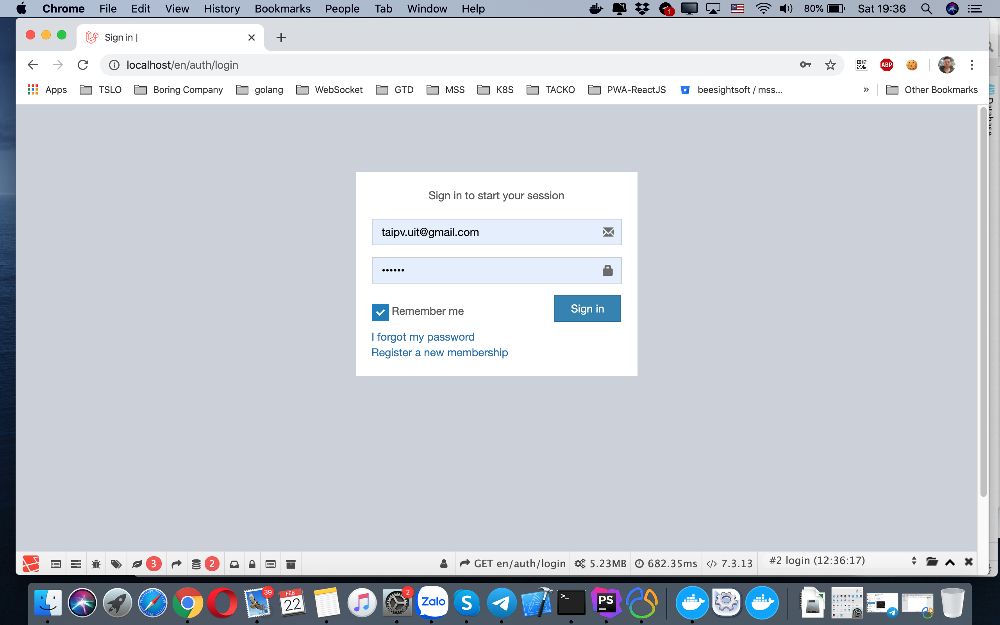
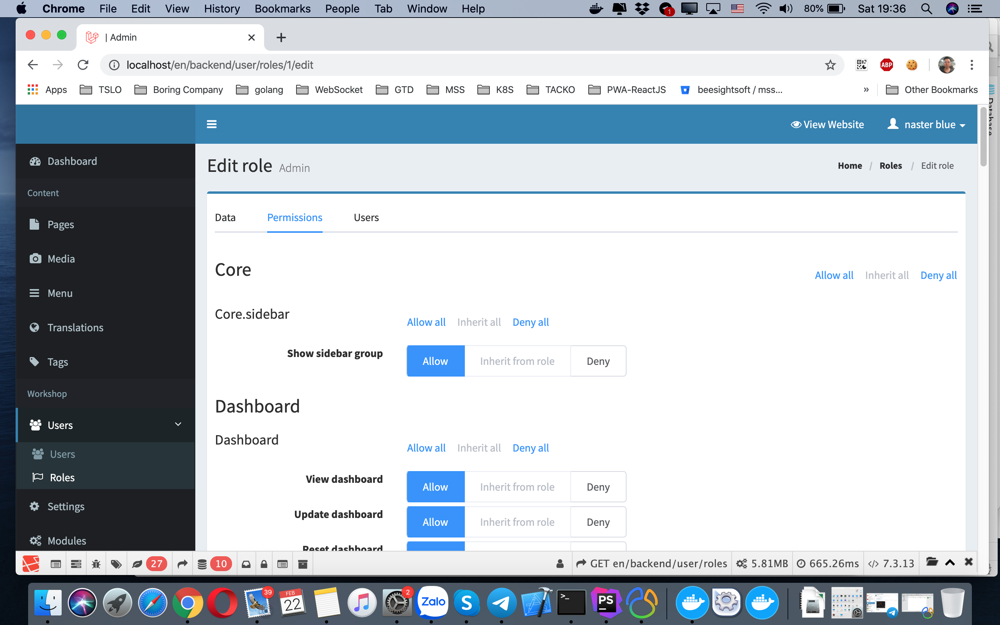

Introduction
============
We will install and run Asgard CMS by docker stack :
```text
NGINX web server
MYSQL database
REDIS cache
```
* [AsgardCms
   A modular multilingual CMS built with Laravel 5, with an MIT license.](https://asgardcms.com/)

System Requirements
===================
```bash
docker
docker-compose
```

Directory Structure
===================
```text
+ asgardcms-docker <root directory>
  + laradock <docker stack>
```

1.Build Docker stack
====================
1.0.Working directory : `/laradock <docker stack>`
```bash
➜  asgardcms-docker cd laradock 
➜  laradock git:(master) ✗ 
```

1.1.Create .env
```bash
➜  laradock git:(master) ✗ cp env-example  .env
```
1.2.Then update mysql/nginx/redis configuration in .env
```bash
# Define the prefix of container names.
COMPOSE_PROJECT_NAME=asgardcms-laradock
```

```bash
# PHP version of the Workspace and PHP-FPM containers
# Accepted values: 7.4 - 7.3 - 7.2 - 7.1 - 7.0 - 5.6
PHP_VERSION=7.3
```

```bash
### MYSQL #####
MYSQL_VERSION=latest
MYSQL_DATABASE=asgardcms
MYSQL_USER=asgardcms
MYSQL_PASSWORD=asgardcms
MYSQL_PORT=3306
MYSQL_ROOT_PASSWORD=asgardcms

```
```bash
### REDIS #####
REDIS_PORT=6379

```
```bash
### NGINX #####
NGINX_HOST_HTTP_PORT=80
NGINX_HOST_HTTPS_PORT=443
NGINX_HOST_LOG_PATH=./logs/nginx/
NGINX_SITES_PATH=./nginx/sites/
NGINX_PHP_UPSTREAM_CONTAINER=php-fpm
NGINX_PHP_UPSTREAM_PORT=9000
NGINX_SSL_PATH=./nginx/ssl/

```

1.3.Run docker-compose
```bash
➜  laradock git:(master) ✗ docker-compose up -d nginx mysql redis laravel-horizon
```

1.4.Verify all done
```bash
➜  laradock git:(master) ✗ docker ps
CONTAINER ID        IMAGE                                COMMAND                  CREATED             STATUS              PORTS                                 NAMES
acfe204292b1        asgardcms-laradock_nginx             "/bin/bash /opt/star…"   28 minutes ago      Up 28 minutes       81/tcp, 0.0.0.0:80->80/tcp, 443/tcp   asgardcms-laradock_nginx_1
6bbdcadef86b        asgardcms-laradock_php-fpm           "docker-php-entrypoi…"   28 minutes ago      Up 28 minutes       9000/tcp                              asgardcms-laradock_php-fpm_1
6848c2af2394        asgardcms-laradock_laravel-horizon   "/usr/bin/supervisor…"   28 minutes ago      Up 28 minutes                                             asgardcms-laradock_laravel-horizon_1
e2cdbc9b3784        asgardcms-laradock_workspace         "/sbin/my_init"          28 minutes ago      Up 28 minutes                                             asgardcms-laradock_workspace_1
f8373d74d46a        asgardcms-laradock_mysql             "docker-entrypoint.s…"   28 minutes ago      Up 28 minutes       0.0.0.0:3306->3306/tcp, 33060/tcp     asgardcms-laradock_mysql_1
ab08ba38616f        asgardcms-laradock_redis             "docker-entrypoint.s…"   28 minutes ago      Up 28 minutes       0.0.0.0:6379->6379/tcp                asgardcms-laradock_redis_1
23868938380e        docker:19.03-dind                    "dockerd-entrypoint.…"   28 minutes ago      Up 28 minutes       2375-2376/tcp                         asgardcms-laradock_docker-in-docker_1
```

2.Install and run Asgard CMS
============================
2.0.Working directory : `asgardcms-docker <root directory>`
```bash
➜  asgardcms-docker docker ps
CONTAINER ID        IMAGE                                COMMAND                  CREATED             STATUS              PORTS                                 NAMES
acfe204292b1        asgardcms-laradock_nginx             "/bin/bash /opt/star…"   28 minutes ago      Up 28 minutes       81/tcp, 0.0.0.0:80->80/tcp, 443/tcp   asgardcms-laradock_nginx_1
6bbdcadef86b        asgardcms-laradock_php-fpm           "docker-php-entrypoi…"   28 minutes ago      Up 28 minutes       9000/tcp                              asgardcms-laradock_php-fpm_1
6848c2af2394        asgardcms-laradock_laravel-horizon   "/usr/bin/supervisor…"   28 minutes ago      Up 28 minutes                                             asgardcms-laradock_laravel-horizon_1
e2cdbc9b3784        asgardcms-laradock_workspace         "/sbin/my_init"          28 minutes ago      Up 28 minutes                                             asgardcms-laradock_workspace_1
f8373d74d46a        asgardcms-laradock_mysql             "docker-entrypoint.s…"   28 minutes ago      Up 28 minutes       0.0.0.0:3306->3306/tcp, 33060/tcp     asgardcms-laradock_mysql_1
ab08ba38616f        asgardcms-laradock_redis             "docker-entrypoint.s…"   28 minutes ago      Up 28 minutes       0.0.0.0:6379->6379/tcp                asgardcms-laradock_redis_1
23868938380e        docker:19.03-dind                    "dockerd-entrypoint.…"   28 minutes ago      Up 28 minutes       2375-2376/tcp                         asgardcms-laradock_docker-in-docker_1
```
2.1.Enter the Workspace container, to execute commands
```bash
➜  asgardcms-docker docker exec  -it e2cdbc9b3784 bash
root@e2cdbc9b3784:/var/www# 
```
2.2.Install the Asgard CMS
```bash
➜  asgardcms-docker docker exec  -it e2cdbc9b3784 bash
root@e2cdbc9b3784:/var/www# php artisan asgard:install
                                        
  Welcome!                              
  Starting the installation process...  
                                        
Successfully created .env file

 Enter your database driver (e.g. mysql, pgsql) [mysql]:
 > mysql

 Enter your database host [127.0.0.1]:
 > mysql

 Enter your database port [3306]:
 > 3306

 Enter your database name [homestead]:
 > asgardcms

 Enter your database username [homestead]:
 > asgardcms

 Enter your database password (leave <none> for no password) [secret]:
 > asgardcms

Database successfully configured

 Enter you application url (e.g. http://localhost, http://dev.example.com) [http://localhost]:
 > http://localhost

                                     
  User Module                        
  Starting the User Module setup...  
                                     

 Enter your first name:
 > naster

 Enter your last name:
 > blue

 Enter your email address:
 > taipv.uit@gmail.com

 Enter a password:
 > 

 Please confirm your password:
 > 

Please wait while the admin account is configured...
The application is now installed
Platform ready! You can now login with your username and password at /backend

```

2.3 Configuration file .env need to be update too
From 
```bash
REDIS_HOST=127.0.0.1
```
To
```bash
REDIS_HOST=redis
```


2.3 Open your browser and visit your localhost address. Happy hacking!

